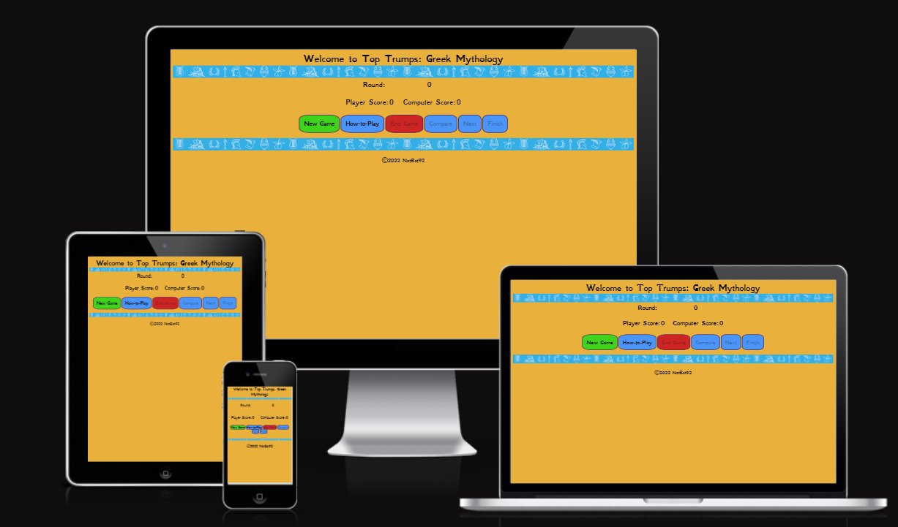

# Top Trumps - Greek Mythology

This is a web-based version of the card game classic that is: Top Trumps.

## Customer Goals

* Easy to understand
* Attractive design
* Interactive with visible prompts, such as a visible scoring panel and round indication

# UX

## Scope

To achieve the goals I set out for this game, I included the following features:

* An easy to use webpage with buttons that are colour coded so they can be distinguished from each other.
* Simple card structure with a user friendly font that is easily readable.
* A contrasting colour scheme to make the page more accessible for all users.

## Structure

For this web-based game, I wanted something that was eye catching and would be easily accessible for everyone. I structured the web page with a bold title which instantly tells you what the page is about and the game it contains. I created buttons to allow user interaction with the game and ease of viewing: 

* A button to begin the game
* A button to compare your cards with the Computer
* A button to end the game at any point during the game
* A button to progress to the next round 
* A button to show a 'how-to-play' pop-up containing instructions, which reduces the need for scrolling when on a larger screen. 

Below this, the game cards are shown where the Players and Computers cards are compared during the game. For each round, the Computers card remains hidden until the user has picked their attribute and clicked 'Compare'. 

## Skeleton

I created quick sketches of what I wanted the game to look like in Excel, this was the easiest way to define the space and the frame of the site in its basic form.

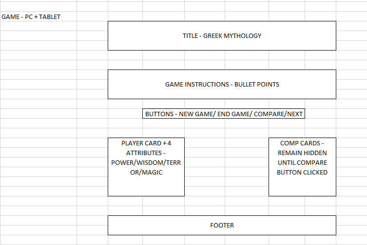

The project end product looks slightly different to my plan, I removed the 'how-to-play' section and put that into a modal pop-up button instead for user friendliness. Also, I have added a couple of additional buttons to make the game run smoothly, some disappearing once clicked to facilitate a smooth user interaction.

## Surface

The colour scheme of the website was chosen to provide simplicity and to match colours used in artwork that depict the Greek Gods. The logo colour was chosen as it stood out on the sandy coloured background. The sandy background was chosen as it is a solid basic colour that made the blue colour stand out.

I chose the font 'GFS Neohellenic' throughout as it looks appealing for the Game and the theme I planned. This font looks very similar to fonts used for other sites/games that revolve around Greece and its mythology. Furthermore, 'Sans-serif' was used as the default alternative in the event my chosen font couldn't be loaded by the browser.

# Features

## Score Area

The score area of the web page contains a round counter to show the user which round is currently being played, this area also contains the scoring records for the Player and the Computer which updates depending on the outcome of the hand.

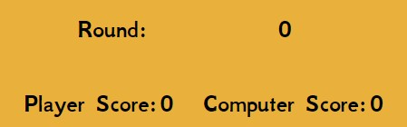

## Game Buttons

The game buttons are there to begin the game and they provide easy navigation throughout the game. The 'New Game' button once clicked, will disappear to prevent the user from clicking this again. There is an 'End Game' button which will reload the page so the game resets and the user can play again, at any point during the game. The 'Compare' and 'Next' button will enable and disable as you go through the game to prevent the user from encountering errors in the scoring and the round counting, and prompt the user on which button to click next. There is a 'How-to-Play' button and a 'Finish' button which, when clicked, will display a pop up modal containing instructions for playing the game and the outcome of the game.

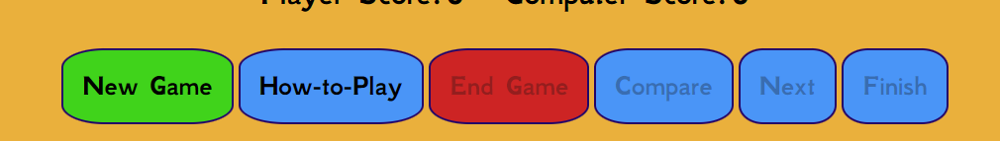

## Game Area

The game area is simply designed with 2 boxes which have a blue border and white centre to distinguish them from the background. 
The boxes are initially hidden, upon clicking 'New Game', the Players card will display to show their first god/creature card, the attribute values will be displayed next to the corresponding features.  There are radio buttons for the user to select the attribute that will be compared to the Computers first god/create card. The Computers first god/creature card will only show the name of the god/creature. When the 'Compare' button is clicked, the users selected attribute will be compared to the corresponding attribute of the Computers card. 

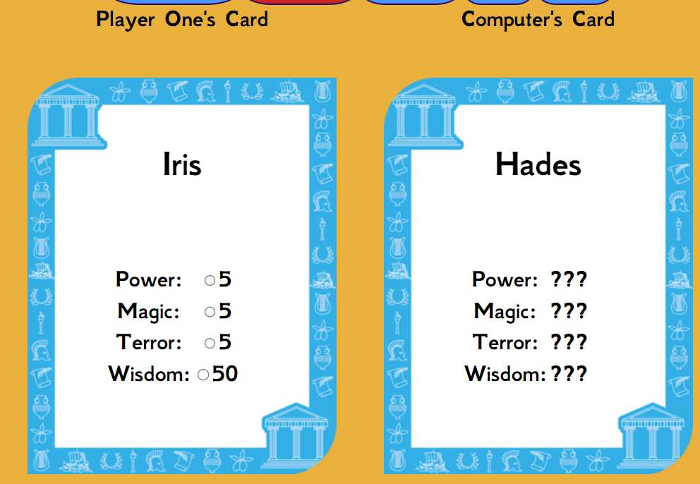

## Footer

The footer is nice and simple and just references copyright for the game page as mine.

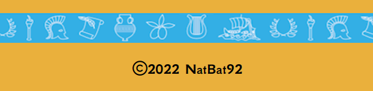

## Features left to implement

* Include more rounds
* Add more cards to the deck
* Make the game locally multiplayer
* Add functionality for the user to enter their name as the 'Player'

## Technologies used

[HTML](https://developer.mozilla.org/en-US/docs/Web/HTML)

* HTML was used as the main building block for content structure.

[CSS](https://developer.mozilla.org/en-US/docs/Web/CSS)

* CSS was used to set the layout of the site and the features within it and to make the website responsive for multiple screen sizes.

[Google Developer Tools](https://developer.chrome.com/docs/devtools/)

* Google Dev Tools were used so I could check my website through all stages of development and ensure it was responsive.

[Google Fonts](https://fonts.google.com/)

* Google fonts is where I chose the font that is seen throughout the website.

[github](https://github.com/)

*  Github was used to store the code for the project.

[Git](https://git-scm.com/)

* Git was used for version control to commit and push to Github.

[Gitpod](https://www.gitpod.io/)

* Gitpod was used as the development environment.

[WebAim](https://webaim.org/resources/contrastchecker/)

* I used this website to check to contrast of colours for the background colour and text colour.

[W3C Markup Validation Service](https://validator.w3.org/)

* This was used to test my code and to make sure there were no errors.

[W3C CSS Validation Service](https://jigsaw.w3.org/css-validator/)

* This was used to test my code and to make sure there were no errors or redundant code that didn't need to be there.

[JSHint](https://jshint.com/)

* This was used to check the javascript and make sure there were no errors

[Am I Responsive](https://ui.dev/amiresponsive)

* I used this to demonstrate what my website would look across different devices.

# Testing

## User Stories

1. As a first time user, I want to be able to learn the game in a way that is simple and clear.
* There is 'How-to-Play' button which opens a pop-up window whch details a simple guide in how to play the game.

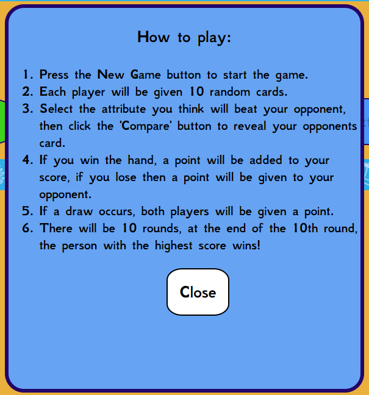

2. As a user, I want a simple game design which has obvious features where I can see my score and know which round I am on.
* Above the game cards there is a section dedicated to the score and the round counters.

## Testing

I tested my game on a few platforms including Microsoft Edge, Chrome and Android web browsers. I confirmed my project is responsive by using the dev tools on the web browsers and changing the sizes of the screen. I have tested the buttons and other features to check that they all work as they should. When troubleshooting the game, I used console.log("") to debug my code and locate any errors to see if a function was working as it should or if it was doing something different to what I wanted it to do.

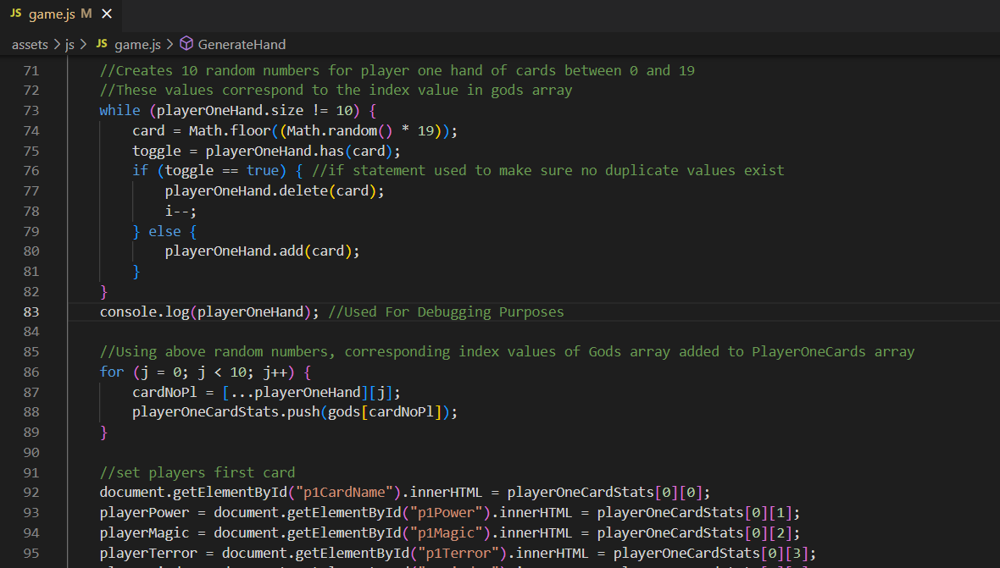

## Validator Testing

### HTML
* The game page passed the HTML validator.

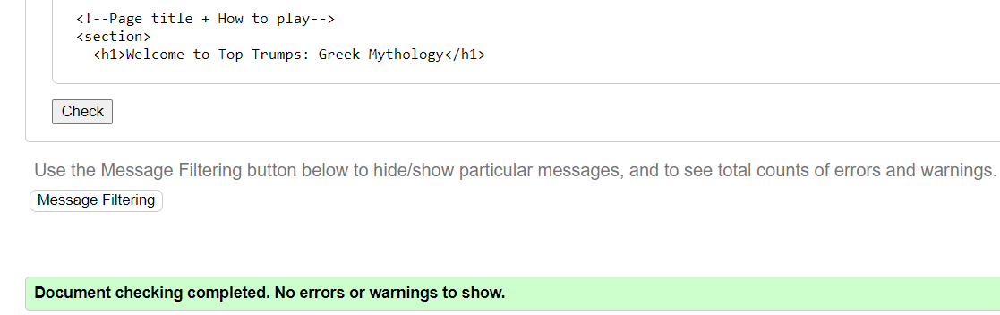

### CSS
* When I ran my CSS through the validator it passed without error.

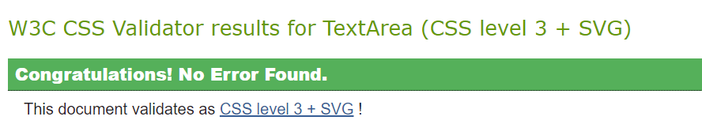

### Accessibility
* I can confirm the colours and font I chose are easy to read and accessible when running lighthouse in Dev tools.

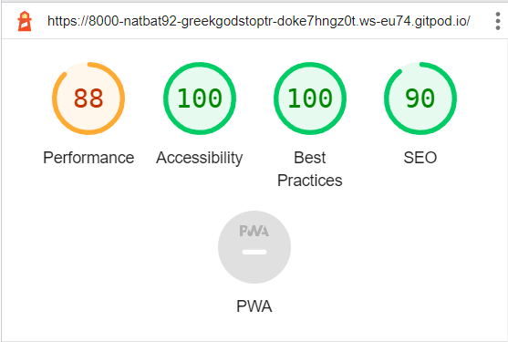

### Javascript
* I can confirm the javascript contained no errors when I ran it through JSHint.

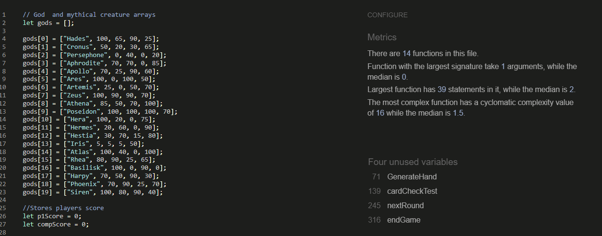

## Deployment

I followed these steps to deploy my website:
* Log into Github
* Selected the greek-gods-top-trumps repository
* Click the settings button
* Select 'pages' on the left hand side
* In the sources section, select branch 'main' and save
* After a few seconds the link to website was provided as seen below

# Credits

## Code
* General coding queries were answered by using [W3Schools](https://www.w3schools.com/html/)

* A Javascript question was answered on Slack [Slack](https://slack.com/intl/en-gb/)

# Acknowledgements
I would like to thank my mentor, Andre Aquilina, for his support, help, guidance and ideas he had about certain features I could add to the game to ensure best user experience and ease of use, and also my partner for her assistance in explaining other methods that weren't covered in the course content that I have used in my game.