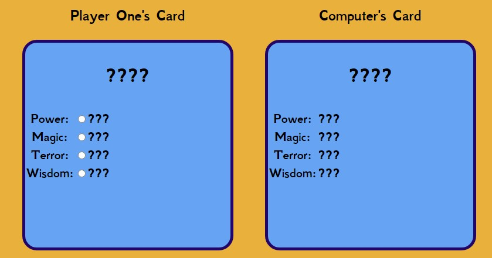

Am I responsive image

# Top Trumps - Greek Mythology

This is a web-based version of the card game classic that is: Top Trumps.

## Customer Goals

* Easy to understand
* Attractive design
* Interactive with visible prompts such as visible scoreing/ rounds

# UX

## Scope

To achieve the goals I set out for this game, I included the following features:

* An easy to use webpage with buttons that are colour coded so they can be distinguished from each other.
* Simple card structure with a user friendly font that the user will easily be able to read.
* A contrasting colour scheme to make the page more accessible for users

## Structure

For this web-based game, I wanted something that was eye catching and would be easily accessible for everyone. The way i structured it was a bold title which instantly tells you what the page is about and contains, a few buttons which are required to begin the game/ compare your cards with the computer/ end the game/ go to the next round and a how-to-play button which will bring up a pop-up containing the instructions which reduces the need for scrolling when on a larger screen. Below this is the game are where the players and computers cards are shown (the computers cards remain hidden until the user has picked their attribute and clicked compare). 

## Skeleton

I created quick sketches of what I wanted the game to look like in Excel as it was easy to define the space and the frame of the site in its basic form.

## Surface

The colour scheme of the website was chosen to provide simplicity and to match colours used in artwork that depict the Greek Gods. The logo colour was chosen as it stood out on the sandy coloured background. The sandy background was chosen as it is a solid basic colour that made the blue colour stand out.

I chose the font 'GFS Neohellenic' throughout as it looks appealing for the Game and the theme I was going for. This font looks very similar to fonts used for other sites/ games that revolve around Greece and it's mythology. Furthermore, 'Sans-serif' was used as the default go to in case my chosen font couldn't be loaded. I used a hover effect on the navigation bar to attract attention and demonstrate the ease of navigation across all pages.

# Features

## Game Buttons

ADD HOW-TO-PLAY BUTTON AND GET SCREENSHOT

## Game Area

The game area is simply laid out with 2 boxes which I have coloured blue to distinguish them from the background. In the boxes to begin with there are just ??? until new game is clicked then the Players card will change to show a god/ creature card and attributes will be displayed next to the corresponding feature. There are also radio buttons for the user to click on, once one is selected that is the attribute that will be compared when the user clicks the compare button.

## Footer

The footer is nice and simple and just references copyright for the game page as mine

ADD SCREENSHOT HERE

## Features left to implement

* Include more rounds
* Add more cards to the deck
* make the game locally multiplayer

## Technologies used

[HTML](https://developer.mozilla.org/en-US/docs/Web/HTML)

* HTML was used as the main building block for content structure.

[CSS](https://developer.mozilla.org/en-US/docs/Web/CSS)

* CSS was used to set the layout of the site and the features within it and to make the website responsive for multiple screen sizes.

[Google Developer Tools](https://developer.chrome.com/docs/devtools/)

* Google Dev Tools were used so I could check my website through all stages of development and ensure it was responsive.

[Google Fonts](https://fonts.google.com/)

* Google fonts is where I chose the font that is seen throughout the website.

[github](https://github.com/)

*  Github was used to store the code for the project.

[Git](https://git-scm.com/)

* Git was used for version control to commit and push to Github.

[Gitpod](https://www.gitpod.io/)

* Gitpod was used as the development environment.

[WebAim](https://webaim.org/resources/contrastchecker/)

* I used this website to check to contrast of colours for the background colour and text colour.

[W3C Markup Validation Service](https://validator.w3.org/)

* This was used to test my code and to make sure there were no errors.

[W3C CSS Validation Service](https://jigsaw.w3.org/css-validator/)

* This was used to test my code and to make sure there were no errors or redundant code that didn't need to be there.

[Am I Responsive](https://ui.dev/amiresponsive)

* I used this to demonstrate what my website would look across different devices.

# Testing

## User Stories

1. As a first time user I want to be able to learn the game in a way that is simple and clear.
* There is How-to-Play button which opens a pop-up window whch details a simple guide in how to play the game.

2. As a user I want a simple game design which has obvious features where I can see my score and know which round I am on.
* Above the game cards there is a section dedicated to the score and the round counters.

## Testing

I tested my game on a few platforms including Microsoft Edge, Chrome and Android web browsers. I confirmed my project is responsive by using the dev tools on the web browsers and changing the sizes of the screen. I have tested the buttons and other features to check that they all work as they should. When troubleshooting the game I used console.log("") to locate any errors or to see whether a function was working or if it was doing something different to what i wanted it to do.

## Validator Testing

### HTML
* All five of my web pages were tested using the official W3C Validator and they passed without error.

### CSS
* When I ran my CSS through the validator it passed without error.

### Accessibility
* I can confirm the colours and font I chose are easy to read and accessible when running lighthouse in Dev tools.

## Deployment

I followed these steps to deploy my website:
* Log into Github
* Selected the greek-gods-top-trumps repository
* Click the settings button
* Select 'pages' on the left hand side
* In the sources section, select branch 'main' and save
* After a few seconds the link to website was provided as seen below

# Credits

## Code
* General coding queries were answered by using [W3Schools](https://www.w3schools.com/html/)

# Acknowledgements
I would like to thank my mentor, Andre Aquilina, for his support, help, guidance and ideas he had about certain features I had on the website and how to improve them. And also my partner for her assistance in explaining other methods that weren't covered in the course content that I have used in my game.